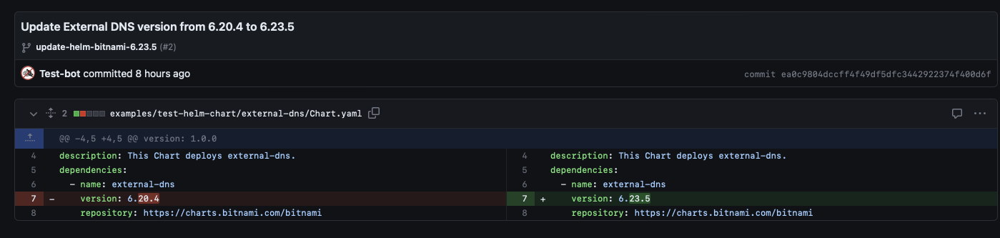
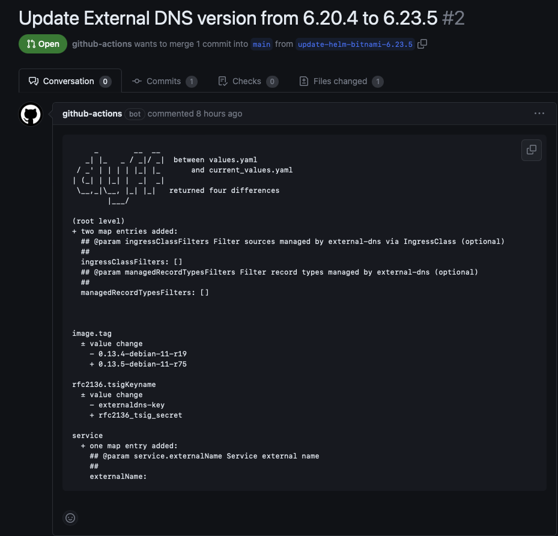
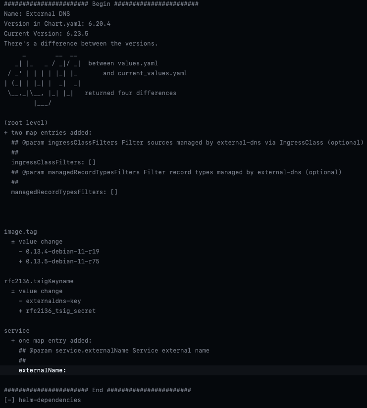

# Keep Helm Dependencies Up to Date

**_NOTE:_** this project was inspired by [hckops](https://github.com/hckops/actions)!

To test it, fork this repo. I recommend you to fork the main branch only.

## Default - The GitHub Way

**_NOTE:_** you need to change the workflow permissions from `Read repository contents and package permissions` to `Read and write permissions` under your repository (Settings -> Actions -> General -> Workflow permissions).

You can keep the config like:

```
name: test-helm-dependencies

on:
  # enable manual trigger
  workflow_dispatch:
  schedule:
    - cron: "0 0 * * *"
  push:
    branches:
      - main
    paths:
      - ".github/workflows/test-helm-dependencies.yml"
      - "helm-dependencies/**"
      - "examples/dependencies.yaml"

jobs:
  test-helm-dependencies:
    name: Test Example Chart
    runs-on: ubuntu-latest
    steps:
      - name: Checkout
        uses: actions/checkout@v3

      - name: Helm Dependencies
        uses: ./helm-dependencies
        with:
          config-path: examples/dependencies.yaml
          user-email: "dep-sheriff-bot@users.noreply.github.com"
          user-name: "dep-sheriff-bot"
          default-branch: "main"
          dry-run: false
          github-run: true
        env:
          GITHUB_TOKEN: ${{ secrets.GITHUB_TOKEN }}
```

The Action will be triggered on push to main or every 12 hours as cronjob.

You will get an output like:




## Info - The Dry-Run Way

You need only to set the `github-run` flag to `false` and the `dry-run` flag to `true` like:

```
name: test-helm-dependencies

on:
  # enable manual trigger
  workflow_dispatch:
  schedule:
    - cron: "0 0 * * *"
  push:
    branches:
      - main
    paths:
      - ".github/workflows/test-helm-dependencies.yml"
      - "helm-dependencies/**"
      - "examples/dependencies.yaml"

jobs:
  test-helm-dependencies:
    name: Test Example Chart
    runs-on: ubuntu-latest
    steps:
      - name: Checkout
        uses: actions/checkout@v3

      - name: Helm Dependencies
        uses: ./helm-dependencies
        with:
          config-path: examples/dependencies.yaml
          user-email: "dep-sheriff-bot@users.noreply.github.com"
          user-name: "dep-sheriff-bot"
          default-branch: "main"
          dry-run: true
          github-run: false
        env:
          GITHUB_TOKEN: ${{ secrets.GITHUB_TOKEN }}
```

The Action will be triggered on push to main or every 12 hours as cronjob.

You will get an output like:



## Remote - Use this action from this repo

create a `dependencies.yaml` like:

```
dependencies:
  - name: "External DNS"
    source:
      file: examples/test-helm-chart/external-dns/Chart.yaml
      path: .dependencies[0].version
    repository:
      name: bitnami/external-dns
      path: .dependencies[0].repository
```

Create file `.github/workflows/helm-dependencies-update.yml`

```
name: helm-dependencies-update

on:
  workflow_dispatch:
  schedule:
    - cron: "0 0 * * *"
  push:
    branches:
      - main
    paths:
      - ".github/workflows/helm-dependencies-update.yml"
      - "dependencies.yaml"

jobs:
  test-helm-dependencies:
    name: "Test: Helm Dependencies Update on Example Chart"
    runs-on: ubuntu-latest
    steps:
      - name: Checkout
        uses: actions/checkout@v3

      - name: Helm Dependencies
        uses: la-cc/gh-actions/helm-dependencies@v0.0.3-1
        with:
          config-path: dependencies.yaml
          user-email: "dep-sheriff-bot@users.noreply.github.com"
          user-name: "dep-sheriff-bot"
          default-branch: "main"
          dry-run: false
          github-run: true
        env:
          GITHUB_TOKEN: ${{ secrets.GITHUB_TOKEN }}
```
